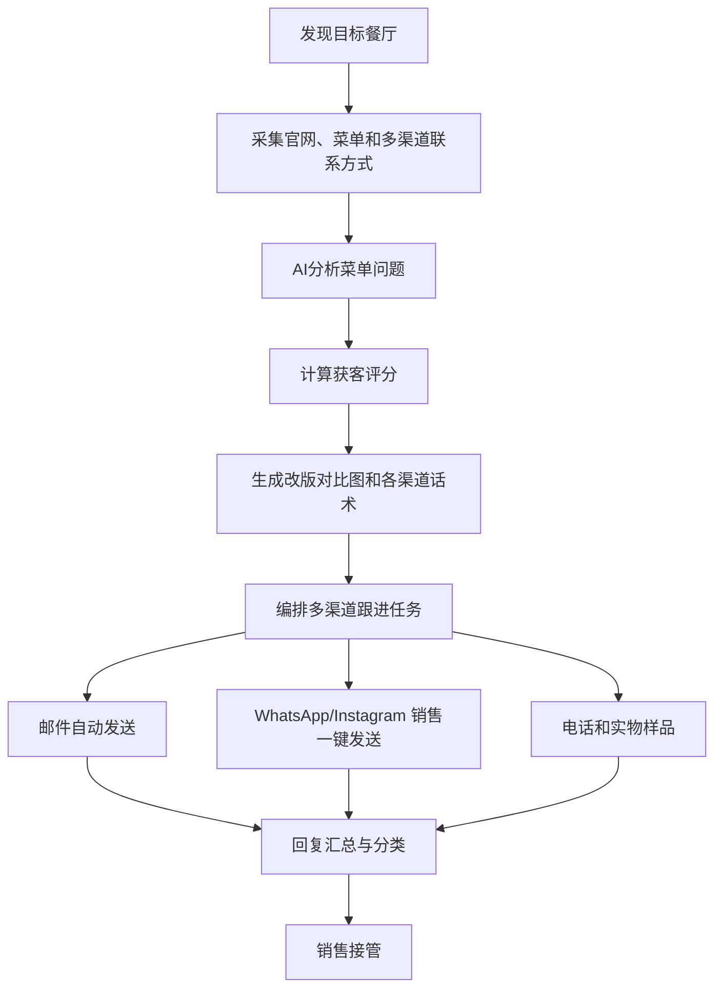

# 欧洲餐厅菜单设计与印刷获客系统方案

## 一 项目结论

为向欧洲餐厅提供菜单设计与印刷服务的客户，建设一套主动获客系统：

> 自动发现可能需要菜单改版的餐厅，分析现有菜单问题，生成个性化的多渠道触达内容，编排邮件、WhatsApp、Instagram、电话和实物样品的跟进任务，并把有意向的客户交给销售人员。

第一阶段不建议覆盖整个欧洲。应先选择：

- 1 个国家；
- 3～5 个城市；
- 1 种主要语言；
- 2～3 类餐厅；
- 运行 6 周验证获客效果。

系统的核心不是“批量群发”，而是通过真实的菜单问题和免费菜单体检，提高销售触达的相关性。

很多餐厅老板很少查看邮箱，尤其是 info@ 这类公共邮箱，只发邮件很可能根本不被看到。因此系统必须在老板真正会看的渠道上触达：电话、WhatsApp、Instagram 和实物样品，邮件只是其中之一。

多渠道的原则是 **系统自动准备，销售一键发送**：

- 系统自动完成找餐厅、分析菜单、生成改版对比图和各渠道话术；
- WhatsApp、Instagram 等渠道由销售逐条确认后发送，每个账号每天几十条；
- 不使用非官方工具自动群发 WhatsApp 或 Instagram，避免账号被限流或封禁、获客渠道中断。

## 二 业务定位

### 目标客户业务

- 服务：餐厅菜单设计与印刷；
- 市场：欧洲；
- 当前获客方式：销售主动开发；
- 第一阶段目标：多渠道触达和持续跟进。

### 系统提供的价值

- 减少销售查找餐厅和整理联系方式的时间；
- 自动判断哪些餐厅更可能需要菜单改版；
- 根据每家餐厅的实际菜单问题生成个性化的邮件、WhatsApp、Instagram 私信和电话话术；
- 每天为每个销售生成触达任务清单，按渠道和时间编排跟进，避免线索遗漏；
- 自动识别有兴趣、询价、拒绝和退订等回复，任一渠道回复后停止其他渠道的跟进；
- 统计从名单、触达、回复、预约、报价到成交的完整漏斗，并按渠道对比效果。

## 三 获客业务流程

### 1 发现目标餐厅

数据来源原则：

> 优先使用许可允许存储的开放数据和政府登记；商业 API 只做实时展示；不使用抓取 Google Maps 的工具或数据集。

Google Places 条款只允许长期保存 place_id，禁止保存名称、地址、评分等内容，每次文本搜索最多返回 60 条，因此不能作为城市级的全量发现来源。餐厅发现分为三层：

| 层级 | 用途 | 数据来源（试点：英国） | 存储方式 |
|---|---|---|---|
| 底库 | 国家、城市、菜系、地址、是否有官网、基础联系方式 | 英国食品标准局（FSA）食品卫生评级全量数据（餐厅、酒吧、外卖三类）+ Overture Maps Places（`basic_category` 属于 restaurant、bar、cafe，confidence ≥ 0.6）；OpenStreetMap 作交叉校验；Foursquare 开放数据集（FSQ OS Places）作补充 | 可存；每条记录保存来源、许可和数据版本 |
| 新开业信号 | 新开业、易主、更换品牌 | FSA 新增且状态为“等待检查”（AwaitingInspection）的记录；英国公司注册处（Companies House）新成立的 SIC 56101/56102 餐厅公司；地方议会场所许可的新申请或转让；Overture 相邻版本新增的记录；FSQ OS Places 的 `date_created` | 可存；每日或每周增量同步 |
| 实时补充 | 评分、评论数、价位、营业状态 | Google Places（只存 place_id，销售打开线索详情时实时拉取，不与地图同时展示）；可选 Tripadvisor 或 Foursquare 付费接口实时拉取 | 不入库；只在线索详情页显示 |

筛选条件对应调整：

- 国家、城市、菜系、是否有官网：来自底库；
- 是否提供在线菜单：由官网采集结果判断；
- 新开业、易主、更换品牌：来自新开业信号层，新开业餐厅优先触达；
- 评分、评论数和价位：只作实时参考，不作为批量筛选条件。如果必须参与排序，先请法律人士确认是否超出 Google 条款允许的用途；否则用替代信号，例如 Overture confidence、是否有官网、社交账号是否活跃。

各国可用的底库和信号：

| 国家 | 底库 | 新开业信号 | 说明 |
|---|---|---|---|
| 英国（首选） | FSA 全量 + Overture | FSA 等待检查记录、Companies House 新公司、议会场所许可 | 全部免费，组合最完整 |
| 法国（第二阶段） | 法国企业登记（SIRENE）+ Overture | SIRENE 门店开业日期 | 2027-01-01 起餐厅行业代码由 56.10A 改为 56.11G |
| 爱尔兰 | Overture | 爱尔兰公司注册处（CRO）开放数据 | 没有公开的食品经营者名单 |
| 丹麦 | 官方食品检查数据 + Overture | 未检查记录 | 数据中带有拒绝广告标记，须直接写入禁止联系名单 |

不使用以下来源：抓取 Google Maps 的工具或数据集（如 gosom/google-maps-scraper、Outscraper、Bright Data 的 Google Maps 数据集）、Yelp（条款禁止用于直接营销）、外卖平台菜单抓取。

### 2 采集多渠道联系方式

| 联系方式 | 主要来源（按优先级） | 可否入库 | 覆盖率参考 | 说明 |
|---|---|---|---|---|
| 电话 | Overture → 官网 → FSQ OS Places | 可以 | Overture 89%～93% | Google 电话只做实时核对，不入库 |
| WhatsApp | 官网或 Instagram 上的 `wa.me`、`api.whatsapp.com/send` 链接 | 可以 | OSM 仅 0.07%，官网比例待实测 | 分“已公开 / 可能（手机号）/ 否”三级；已无官方方式验证号码是否注册，不使用非官方号码检测工具 |
| Instagram | 官网结构化数据（JSON-LD 的 `sameAs`）或页脚 → FSQ OS Places → 搜索接口反查 → Instagram 官方 Business Discovery 核验名称和城市 | 可以（只存账号名） | Overture 社交字段几乎都是 Facebook | 联系按钮里的电话和邮箱无法通过官方接口获取 |
| Facebook | Overture `socials` → 官网 | 可以 | Overture 80%～93% | |
| 邮箱 | 官网法定页面（Impressum、mentions légales、aviso legal）→ 联系页 → 隐私政策页 → Overture `emails` | 可以（记录来源网址） | Overture 36%～53% | 剔除个人邮箱；用 email-validator 做语法和 MX 校验；catch-all 地址单独分组 |
| 官网联系表单 | 官网 /contact、/kontakt 等含 `<form>` 的页面 | 可以 | 待实测 | 通常直接进入老板的收件箱 |
| 实体地址 | FSA、SIRENE、Overture | 可以 | FSA 全量覆盖 | 不使用 Google 地址（条款禁止保存）；用于寄样品或上门拜访 |
| 法律形式 | Companies House、爱尔兰 CRO、SIRENE、荷兰商会（KvK，按次收费） | 可以 | — | 区分有限公司和个体经营者：有限公司可发邮件，个体经营者只用电话、样品和联系表单 |
| 老板或负责人姓名 | Companies House 董事、法国网站的出版负责人、德奥 Impressum 中的店主 | 可以（需做合法利益评估） | — | 用于称呼和在 LinkedIn 上找到本人 |
| LinkedIn | 按老板姓名或公司搜索 | 可以 | — | 适合连锁店和餐饮集团 |
| 菜单 | 官网 HTML、PDF、图片；JSON-LD `hasMenu` | 可以 | 待实测 | 外卖平台只记录“是否上架”，不抓取菜单 |
| 评分、价位 | Google、Tripadvisor 实时拉取 | 不可以 | — | 只在线索详情页显示 |
| 拒收标记 | 丹麦官方拒绝广告标记、退订记录 | 可以 | — | 采集时直接写入禁止联系名单 |

官网采集顺序：JSON-LD 结构化数据 → 页脚的 `tel:`、`mailto:`、`wa.me` 和社交链接 → 法定信息页 → 联系页 → 隐私政策页。搜索接口用于反查缺失的官网和社交账号：Bing 搜索接口已于 2025 年关闭，Google Custom Search 已停止接受新用户，建议使用 Brave Search API（约 5 美元/千次）。

Google 地图聊天（Business Messages）已于 2024 年关闭。订位平台和外卖平台不公开商家联系方式，不作为触达渠道。

各渠道和菜单的实际获取比例没有公开统计。试点第一周、正式触达之前，先在伦敦抽取 500 家 FSA 记录，完整跑一遍“匹配 Overture → 抓取官网 → 提取联系方式和菜单”，用实测比例校准评分权重和渠道节奏。

### 3 建立餐厅线索档案

每家餐厅至少保存以下字段：

| 字段 | 用途 |
|---|---|
| 餐厅名称、地址、国家 | 唯一识别、区域筛选和寄送样品 |
| 官网 | 判断经营活跃度 |
| 法律形式（有限公司或个体经营者） | 决定可用的触达渠道 |
| 新开业信号及日期 | 优先触达新开业餐厅 |
| 电话、WhatsApp 及 WhatsApp 置信度 | 电话和 WhatsApp 触达 |
| Instagram、Facebook | 私信触达和判断品牌风格 |
| 公开商业邮箱、联系表单地址 | 邮件触达 |
| 老板或决策人姓名、LinkedIn | 找到决策人 |
| 首选渠道 | 按渠道可用性和餐厅类型确定 |
| 菜单链接或文件 | AI菜单分析 |
| 菜系、价格区间 | 生成对应销售方案 |
| 评论数、评分 | 判断经营规模 |
| 菜单问题 | 个性化触达依据 |
| 每个字段的数据来源、采集时间、数据许可、是否允许存储 | 合规审计和许可管理 |
| Google place_id | 实时拉取评分和价位 |
| 各渠道联系状态、下次跟进时间 | CRM管理 |

### 4 AI分析菜单问题

系统检查：

- 菜单是否为模糊照片或低清扫描件；
- PDF或网页在手机上是否难以阅读；
- 菜品分类是否混乱；
- 字体是否过小；
- 价格和货币格式是否统一；
- 是否缺少当地语言或双语版本；
- 是否缺少过敏原、素食、辣度等标识；
- 菜单风格是否与餐厅定位一致；
- 招牌菜和高利润菜品是否得到突出展示；
- 官网、外卖平台和现有菜单是否存在明显不一致。

系统只能引用实际检测到的问题，不能虚构菜单问题或假装到过餐厅。

### 5 获客机会评分

| 评分维度 | 建议权重 |
|---|---:|
| 菜单质量问题 | 30 |
| 餐厅经营活跃度 | 20 |
| 预计客单价 | 15 |
| 评论数量和经营规模 | 15 |
| 联系方式完整度 | 10 |
| 近期改版迹象 | 10 |

联系方式完整度按可用渠道计算：有电话、WhatsApp、Instagram 或决策人姓名的餐厅得分更高，不只看邮箱。

首期可以将 70 分设为触达阈值，运行后根据正向回复率调整。评分只用于排序，不应宣传为准确的成交概率。

## 四 核心销售策略

### 免费菜单体检

不要只发送“我们可以为您设计菜单”。第一次触达应该指出 1～2 个真实问题，并邀请餐厅查看免费的菜单改版建议。

可以自动生成：

- 一页菜单诊断；
- 菜单封面改版示例；
- 某个菜品分类的重新排版；
- 手机端菜单预览；
- 原菜单与改版示例对比图（适合 WhatsApp 和 Instagram 直接发送）。

改版示例用提取出的菜单数据填充设计模板生成，不直接用 AI 生成整张菜单图片，避免菜名和价格出错。

示例表达：

> 我们查看了贵餐厅网站上的菜单。手机端的主菜价格和说明较难阅读，而且素食菜品没有明显标识。我们制作了一个符合现有品牌风格的局部改版示例，您是否愿意看看？

### 各渠道的用法

| 渠道 | 发送方式 | 内容重点 |
|---|---|---|
| WhatsApp | 系统生成带预填内容的 `wa.me` 链接，销售点击后核对并发送 | 一句话说明问题，附改版对比图 |
| Instagram 私信 | 系统准备好文案和图片，销售在 Instagram 中发送 | 视觉对比，适合年轻、重视风格的餐厅 |
| 邮件 | 系统自动发送 | 完整的菜单诊断和改版建议 |
| 电话 | 系统提供开场白和菜单问题要点，销售拨打 | 找到老板或经理，约时间看示例 |
| 实物样品 | 系统生成按对方品牌风格设计的一页改版菜单，印刷后寄出 | 附二维码链接到完整方案，只寄评分最高的餐厅 |
| LinkedIn | 销售手动联系 | 连锁店和餐饮集团的决策人 |

### 多渠道跟进节奏

系统根据每家餐厅可用的渠道自动编排节奏。默认节奏：

| 时间 | 渠道 | 内容 |
|---|---|---|
| 第 0 天 | WhatsApp（没有则 Instagram 私信） | 指出具体菜单问题，附改版对比图 |
| 第 2 天 | 邮件 | 完整的菜单诊断和局部改版示例 |
| 第 5 天 | 电话 | 确认是否看到示例，约时间沟通 |
| 第 10 天 | Instagram 私信或邮件 | 提供类似餐厅案例、交付周期和服务方式 |
| 第 14 天 | 邮件 | 最后一次跟进，提供明确退出方式 |
| 高分线索 | 实物样品 | 与第 0 天同步寄出，第 5 天电话时询问是否收到 |

缺少某个渠道时自动跳过或替换为其他可用渠道。任何渠道收到人工回复、退订或明确拒绝后，系统都应停止所有渠道的自动跟进。

### 回复汇总与自动分类

- 邮件回复由系统自动接收；
- WhatsApp 和 Instagram 的回复由销售转发或录入系统，系统负责分类和摘要；
- 电话结果由销售在任务中选择结果并填写备注。

| 回复类型 | 系统动作 |
|---|---|
| 有兴趣、询价、索要案例 | 停止所有渠道跟进，通知销售接管 |
| 希望稍后联系 | 记录日期并暂停序列 |
| 已有供应商、暂不需要 | 结束当前序列 |
| 拒绝或退订 | 加入禁止联系名单，所有渠道停止 |
| 自动回复 | 识别假期或自动通知 |
| 邮件退信、号码无效 | 标记该渠道无效，改用其他渠道 |
| 无法判断 | 进入人工审核 |

## 五 欧洲合规与发送安全

欧洲直接营销需要同时考虑 GDPR、电子隐私规则以及目标国家的具体法律。公开的联系方式并不意味着可以无限发送营销信息。

系统必须具备：

- 优先使用餐厅公开的商业联系方式；
- 记录每个联系方式的来源、采集时间和使用目的；
- 首次联系说明发送方身份和联系理由；
- 每次触达提供清晰的拒收方式；
- 退订或拒绝后立即停止所有渠道，并保存抑制记录；
- 按国家配置触达规则、频率和保留期限；
- 保存模板版本、触达记录、退订记录和人工审核日志；
- 不购买来源不明的个人联系方式名单；
- 不虚构到店经历、案例、本地地址或客户身份。

正式运营前，应让目标国家的法律专业人士确认各渠道的营销规则和处理依据。

### 邮件发送信誉

- 使用独立销售域名或子域名；
- 配置 SPF、DKIM、DMARC；
- 从较低的每日发送量开始；
- 监控硬退信率、投诉率和退订率；
- 发生异常时自动暂停发送；
- 不使用客户主域名直接进行高频冷邮件测试。

### WhatsApp 和 Instagram 账号安全

- 不使用非官方工具自动批量发送，每条消息由销售确认后发出；
- 每个账号每天发送量设上限（建议从 20～30 条开始），系统在任务清单中控制数量；
- 使用 WhatsApp Business 应用和 Instagram 企业账号，资料完整、有真实作品展示；
- 消息个性化，引用对方真实的菜单问题，不发送千篇一律的内容；
- 对方回复“不需要”或拉黑后立即停止，避免被举报；
- 监控账号限制、被举报和消息失败情况，发生异常时暂停该账号的任务。

第一阶段建议采用：

> AI生成首次触达内容 → 人工批量审核 → 邮件由系统发送，WhatsApp 和 Instagram 由销售一键发送 → 系统编排后续跟进任务。

验证稳定后，再逐步提高首次触达内容的自动化程度。

## 六 MVP功能范围

### 1 客户名单模块

- 同步开放数据和政府登记（Overture、FSA、Companies House 等），按国家、城市、菜系筛选餐厅；
- 新开业信号监控；
- 餐厅导入和编辑；
- 官网抓取和多渠道联系方式采集（电话、WhatsApp、Instagram、Facebook、邮箱、联系表单、决策人姓名）；
- 公司登记匹配，区分有限公司和个体经营者；
- 去重；
- 数据来源记录；
- 退订和禁止联系名单。

### 2 菜单分析模块

- 获取网页、PDF和图片菜单；
- 提取菜品、分类、价格和语言；
- 检查菜单问题；
- 生成菜单改版机会评分；
- 支持人工修正AI分析结果。

### 3 销售内容模块

- 按目标语言生成邮件、WhatsApp、Instagram 私信和电话话术；
- 引用真实菜单问题；
- 生成菜单体检摘要和改版对比图；
- 生成可印刷的实物样品文件；
- 各渠道模板管理；
- 人工审批。

### 4 多渠道跟进模块

- 按餐厅可用渠道自动编排跟进节奏；
- 邮件自动发送；
- 每日销售任务清单（WhatsApp、Instagram、电话、寄样品）；
- WhatsApp 预填消息链接，一键发送；
- 各账号每日发送上限控制；
- 任一渠道收到回复后停止其他渠道跟进；
- 退订、退信和无效号码处理；
- 销售接管。

### 5 回复和销售工作台

- 汇总各渠道回复；
- 回复意向分类；
- 自动生成回复摘要；
- 电话结果记录；
- 销售人员提醒；
- 跟进任务；
- 预约链接；
- 报价和成交状态。

### 6 数据看板

- 新增餐厅数；
- 高评分线索数；
- 各渠道联系方式覆盖率；
- 送达率；
- 各渠道回复率；
- 各渠道正向回复率；
- 预约数；
- 报价数；
- 成交数；
- 单个成交客户的获客成本；
- 销售每日任务完成率。

## 七 暂不纳入MVP的功能

- 同时覆盖多个欧洲国家；
- AI自主报价、议价和签约；
- 使用非官方工具自动群发 WhatsApp 或 Instagram 私信；
- 短信群发；
- WhatsApp Business API 接入（需要对方事先同意接收消息，适合已有意向的客户，第二阶段再评估）；
- 复杂的多租户SaaS计费；
- 代理商和分销体系；
- 无人工审核的整套菜单自动生成。

## 八 技术架构

| 层级 | 建议技术 | 主要职责 |
|---|---|---|
| 前端 | Next.js、Ant Design | 线索、审批、销售任务清单、工作台、看板 |
| 后端 | Python FastAPI | 业务API、权限、审计、跟进编排 |
| 数据库 | PostgreSQL | 餐厅、多渠道触达、回复和合规记录；字段级来源和许可记录 |
| 开放数据层 | DuckDB + overturemaps-py、quackosm | 按国家读取 Overture Parquet 数据；定时同步 FSA、Companies House、SIRENE；读取 OSM 作交叉校验；多源实体匹配和去重 |
| 官网采集与提取 | httpx 静态抓取，必要时回落到 Crawl4AI 或 Playwright；extruct、phonenumbers、email-validator | 抓取官网，提取结构化数据、电话、邮箱、WhatsApp、社交链接、联系表单和菜单链接；同一域名每秒不超过 1 次请求，遵守 robots.txt，每 90 天刷新 |
| 菜单解析 | HTML 直接取文本，PDF 用 Docling，图片用多模态大模型或 PaddleOCR，再用 Instructor 按固定结构提取 | 提取菜品、分类、价格、语言和过敏原标识 |
| 任务编排 | Redis、Celery + Celery beat | 采集、同步、分析、发送、跟进和通知的统一编排 |
| 大模型 | 可替换模型接口 | 菜单分析、分类、翻译和各渠道文案 |
| 邮件 | 试点期接入 Smartlead 或 Instantly 接口（关闭互刷预热）；自研时用 Gmail 或 Microsoft Graph 接口，模板用 MJML | 邮件发送、接收和线程关联 |
| WhatsApp、Instagram | WhatsApp Business 应用、Instagram 企业账号 | 销售一键发送，系统生成预填链接和素材 |
| 样品生成 | Next.js 模板 + Playwright 渲染，或 Gotenberg 服务；印刷文件的 CMYK 和出血用 Typst 实测后确定 | 改版对比图和可印刷样品 |
| 实时数据缓存 | Redis，设置过期时间 | Google、Tripadvisor、Foursquare 付费接口的字段只放缓存，不写入主表 |
| 文件存储 | S3兼容存储 | 菜单文件、分析结果、对比图和样品 |
| 部署 | Docker Compose，服务器放在英国或欧盟 | 部署和运维；CI 中加入依赖许可证扫描 |

第一阶段使用可控工作流，不需要构建完全自主的 Agent。固定流程更容易调试、审计和处理异常；只把菜单判断、文案生成和回复分类等模糊任务交给模型。

原方案中 n8n 与 Celery 功能重复，统一用 Celery 编排。n8n 的许可证（Sustainable Use License）不是开源许可，不能让客户在其中自行编辑工作流，也不能托管给客户使用，最多作为客户内部通知的辅助工具。

### 开源组件复用

没有成熟的开源项目能覆盖餐厅获客的完整流程。可以复用的是通用组件，获客评分、多渠道跟进编排和销售工作台需要自研。

| 模块 | 复用的开源项目（许可证） | 说明 |
|---|---|---|
| 开放数据读取 | overturemaps-py（MIT）、quackosm（Apache-2.0） | OSM 数据本身是 ODbL，对外分发衍生数据库时需要共享 |
| 官网抓取 | Crawl4AI（Apache-2.0）、Crawlee for Python、Playwright（Apache-2.0） | Crawl4AI 要求在文档中注明使用 |
| 联系方式提取和校验 | extruct（BSD-3）、phonenumbers（Apache-2.0）、email-validator（Unlicense） | 现成的邮箱、社交、WhatsApp 提取器都很小或已停更，提取规则自己写 |
| 菜单解析 | Docling（MIT）、PaddleOCR（Apache-2.0）、Instructor 或 PydanticAI（MIT） | MinerU 和 Marker 的模型权重有商用条件，需评估后才可启用 |
| 样品渲染 | Gotenberg（MIT）、Typst（Apache-2.0） | |
| CRM 参考 | Atomic CRM（MIT） | 客户如需独立 CRM，可通过接口同步到 Twenty 或 Krayin |
| 仅作参考 | gosom/google-maps-scraper、moasq/leadshoot | 前者违反 Google 条款，不用于正式运行；后者思路接近但很早期 |

不使用的组件：

- AGPL 或 GPL 许可证：Firecrawl、PyMuPDF、listmonk、BillionMail、Mautic、reacher、theHarvester；
- 限制商用托管：n8n（作为核心时）、NocoDB（2026 年起改为仅限内部使用）、Carbone 社区版；
- 已停止维护：wkhtmltopdf；
- 违反平台条款：Google Maps 抓取工具、非官方 WhatsApp 自动发送库（Baileys、whatsapp-web.js）。

## 九 开发工作量

| 阶段 | 工作量 |
|---|---:|
| 目标市场和规则确认 | 3～4 人日 |
| 开放数据同步、实体匹配与官网联系方式采集 | 7～10 人日 |
| 菜单获取和AI分析 | 5～8 人日 |
| 各渠道内容、对比图和样品生成 | 4～6 人日 |
| 邮件发送与多渠道跟进编排 | 6～9 人日 |
| 回复汇总、分类与销售工作台 | 5～7 人日 |
| 测试、部署和试运行 | 4～6 人日 |
| 合计 | 34～50 人日 |

## 十 报价建议

| 方案 | 范围 | 建议价格 |
|---|---|---:|
| 验证版 | 人工导入名单、AI菜单分析、各渠道内容生成、邮件自动跟进和销售任务清单 | 2.5万～3.5万元 |
| 标准MVP | 自动采集、评分、菜单体检、改版对比图、多渠道跟进编排、回复分类和看板 | 5万～7万元 |
| 持续运维 | 监控、模板调整、模型和接口维护、小范围迭代 | 2000～5000元/月 |

推荐对客户报价：

> 5.8 万元实施费 + 3000 元/月运维费。

范围限定为一个国家、三至五个城市和一种主要语言，先运行六周。模型、邮箱、地图数据、第三方数据、邮件发送、样品印刷和邮寄费用另行结算。

## 十一 六周验证目标

建议设置以下试运行目标：

- 第一周先抽取 500 家伦敦 FSA 记录，实测 Overture 匹配率、官网抓取成功率、各渠道和菜单的获取比例；
- 筛选约 1000 家餐厅；
- 选择约 300 家高匹配餐厅进行受控的多渠道触达；
- 统计各渠道联系方式覆盖率和送达率；
- 统计各渠道回复率和正向回复率；
- 统计预约、报价和成交数量；
- 比较不同渠道、餐厅类型、城市和话术模板的效果；
- 根据结果调整评分阈值、渠道组合和跟进节奏。

项目验收应以功能稳定、数据可追溯、触达可控和漏斗可统计为主，不承诺固定成交数量。

## 十二 启动前需要确认

1. 首期目标国家、城市和主要语言；
2. 重点餐厅类型；
3. 菜单设计与印刷的平均订单金额；
4. 客户已有案例、作品、价格和交付周期；
5. 现有销售邮箱、域名和CRM；
6. 可用的 WhatsApp 号码、Instagram 账号和销售人数；
7. 实物样品的预算和寄送数量；
8. 餐厅名单来源（默认使用免费开放数据和政府登记）和是否需要付费数据；
9. 首次触达内容审批人和销售接管人；
10. 目标国家确认后的合规规则；
11. 六周试运行的预算和成功判定标准。

## 十三 产品定位表达

不建议对外只说“AI员工”或“群发系统”。建议使用：

> 餐厅菜单销售线索系统

或者：

> Restaurant Menu Sales Intelligence

对客户的核心销售表达：

> 系统持续发现最需要菜单改版的餐厅，自动完成初步研究和改版示例，在老板真正会看的渠道上安排个性化联系和持续跟进，让销售人员把时间花在已经表现出兴趣的客户身上。
